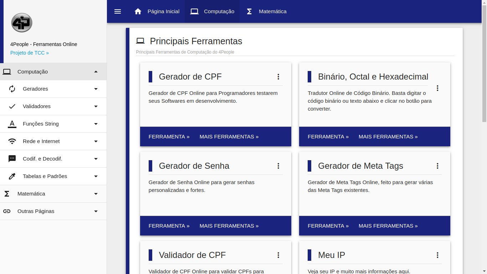

# 4People

## Descrição
  **_4People_** é um projeto de TCC que visa criar ferramentas para _pessoas_ usarem no cotidiano e _Programadores_ testarem seus Softwares.
  O **_4People_** disponibiliza Ferramentas de Computação (Geradores, Validadores, Codificadores e Decodificadores, etc.) e Matemáticas (Calculadoras, Calculadoras de Área e Calculadoras de Datas)

## Tecnologias usadas
- HTML5
- CSS3
- Materialize
- JavaScript
- PHP
- Docker

## Extensões VSCode usadas
- [EditorConfig for VS Code](https://marketplace.visualstudio.com/items?itemName=EditorConfig.EditorConfig)
- [HTML CSS Support](https://marketplace.visualstudio.com/items?itemName=ecmel.vscode-html-css)
- [PHP Extension Pack](https://marketplace.visualstudio.com/items?itemName=felixfbecker.php-pack)
- [PHP Intelephense](https://marketplace.visualstudio.com/items?itemName=bmewburn.vscode-intelephense-client)
- [Visual Studio IntelliCode](https://marketplace.visualstudio.com/items?itemName=VisualStudioExptTeam.vscodeintellicode)
- [vscode-icons](https://marketplace.visualstudio.com/items?itemName=vscode-icons-team.vscode-icons)

## Algumas Features
- Painel Administrativo
	- Controle de Administradores
		- Primeiro login gera um Admin e envia pro e-mail
		- Upload de imagem
	- Controle de Ferramentas
		- Ativar/Desativar Ferramentas
- Proteção contra Brute-Force
- Proteção contra SQL Injection
- Ferramentas escritas em JavaScript

## Ferramentas prontas (36/115)
- Computação
	- 11
- Matemática
	- 25

## Imagens
- Página Inicial

- Computação

- Matemática

- Sobre

- Fale Conosco
