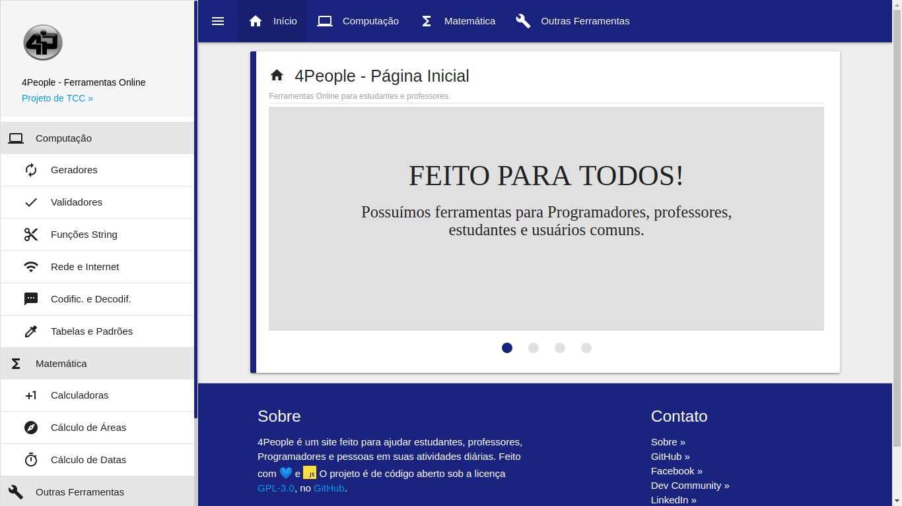

# 4People

## Descrição
  **_4People_** é um projeto de TCC que visa criar ferramentas para _pessoas_ usarem no cotidiano e _Programadores_ testarem seus Softwares.
  O **_4People_** disponibiliza ferramentas que vão desde Geradores (Senhas, CPF, RG, Portfólio) até ferramentas para o uso no cotidiano (Sorteadores, Progresso do Ano, etc.) e ferramentas para jogos (Gerador de Decks, Calculadoras, etc.)

## Imagem
  

## Como contribuir
  - Linux
    - Git
    - Xampp ou PHP

  ```sh
    cd ~/Documents/ &&
    git clone https://github.com/LucasNaja/4People.git &&
    cd 4People &&
    php -S localhost:5500
  ```

  - Windows
    - Git
    - Xampp
      - htdocs

## Integrantes
  - **Lucas Bittencourt**
    - Programador
  - **Jairo Arcy**
    - Programador
  - **Renan de Mattos**
    - Analista
  - **Suzany Silva**
    - Analista

## Linguagens/Bibliotecas/Frameworks/Tecnologias
  - HTML
  - CSS
  - JavaScript 
  - PHP
  - PHPMailer
  - FakerJS
  - MaterializeCSS
  - PWA

## Ferramentas prontas
  - Geradores
    - Gerador de CPF
    - Gerador de Senha
    - Gerador de Meta Tags (Faltam algumas coisas)
  - Validadores
    - Validador de CPF
  - Funções String
    - Contador de Caracteres
  - Rede e Internet
    - Meu IP
  - Tabelas e Padrões
    - Código de Eventos das Teclas
  - Codificadores e Decodificadores
    - Conversor de Código Binário
  - Calculadoras
    - Fatorar Número
    - Máximo Divisor Comum
    - Mínimo Múltiplo Comum
    - Índice de Massa Corporal
    - Porcentagem
    - Equação do 2° Grau
    - Fibonacci
    - Conversor de Temperatura
    - Divisão e Resto
  - Calcular Áreas
    - Área do Círculo
    - Área do Quadrado
  - Datas e Horas
    - Diferenças entre Datas
