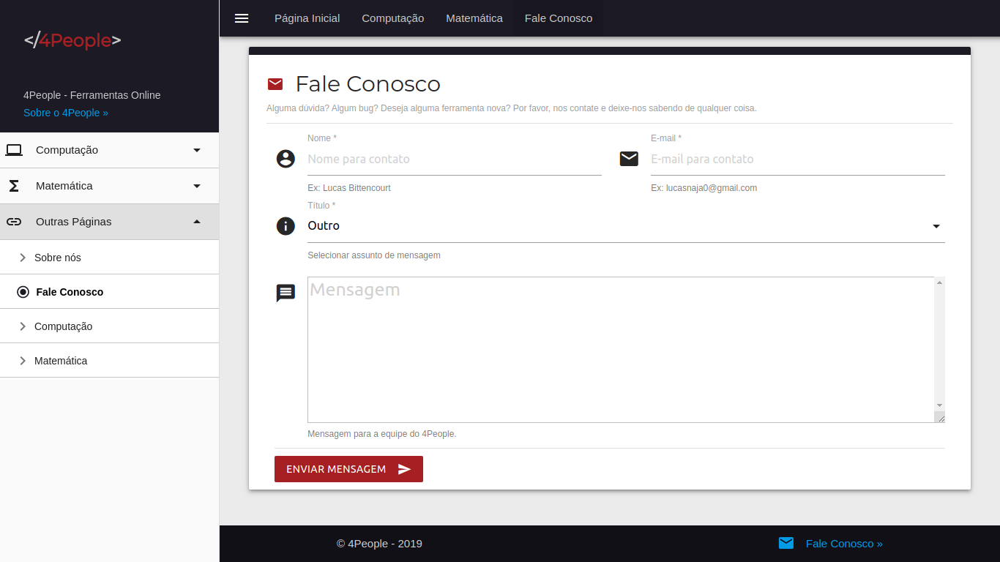

# 4People

## Descrição

  **_4People_** é um projeto de TCC que visa criar ferramentas para _pessoas_ usarem no cotidiano e _Programadores_ testarem seus Softwares.
  O **_4People_** disponibiliza Ferramentas de **Computação** (Geradores, Validadores, Codificadores e Decodificadores, etc.) e **Matemáticas** (Calculadoras, Calculadoras de Área e Calculadoras de Datas)

## Tecnologias usadas

- HTML5
- CSS3
- JavaScript
- PHP
- Materialize
- Docker

## Extensões VSCode usadas

- [EditorConfig for VS Code](https://marketplace.visualstudio.com/items?itemName=EditorConfig.EditorConfig)
- [HTML CSS Support](https://marketplace.visualstudio.com/items?itemName=ecmel.vscode-html-css)
- [PHP Intelephense](https://marketplace.visualstudio.com/items?itemName=bmewburn.vscode-intelephense-client)
- [Docker](https://marketplace.visualstudio.com/items?itemName=ms-azuretools.vscode-docker)
- [Visual Studio IntelliCode](https://marketplace.visualstudio.com/items?itemName=VisualStudioExptTeam.vscodeintellicode)
- [vscode-icons](https://marketplace.visualstudio.com/items?itemName=vscode-icons-team.vscode-icons)

## Algumas Features

- Painel Administrativo
  - Controle de Administradores
    - Primeiro login gera um Admin e envia pro e-mail
    - Upload de imagem
  - Mensagens dos usuários
    - Receber mensagens no Painel Administrativo
    - Responder mensagens direto do Painel Administrativo pro e-mail do usuário
  - Controle de Ferramentas
    - Ativar/Desativar Ferramentas
- Proteção contra Brute-Force
- Proteção contra SQL Injection
- Ferramentas escritas em JavaScript
- Ajax fortemente usado
- Quando sem conexão, é redirecionado para uma página "offline" (PWA)

## Como usar o Projeto

- Clonar este repositório.
  - git clone [https://github.com/lucasnaja/4People.git](https://github.com/lucasnaja/4People.git)
- Importar o banco de dados no MySQL.
  - Localização do database.sql: /assets/database/database.sql
- Windows
  - Colar a pasta 4People no htdocs do xampp.
  - Ou como preferir.
- Linux
  - Ligar o PHP na pasta do 4People.
    - php -S localhost:3000
    - Ou como preferir.

## Como colaborar

- Faça os mesmos passos de Como usar o Projeto acima.
- Faça as mudanças.
- Dê um Commit e abra um PR no [GitHub](https://github.com/lucasnaja/4People) do projeto.

## Autor

| [ @lucasnaja](https://github.com/lucasnaja) |
| :---: |

## Imagens

- Página Inicial

- Página Inicial 2

- Computação

- Matemática

- Fale Conosco

