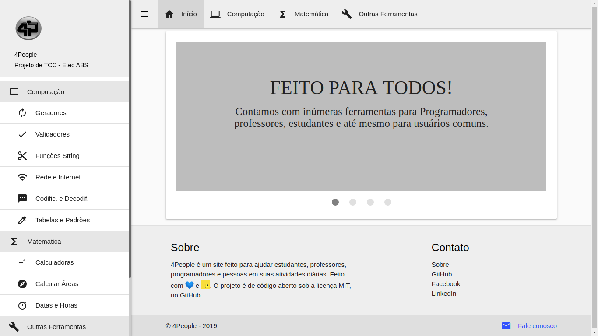

# 4People

## Descrição
  **_4People_** é um projeto de TCC que visa criar ferramentas para _pessoas_ usarem no cotidiano e _Programadores_ testarem seus Softwares.
  O **_4People_** disponibiliza ferramentas que vão desde Geradores (Senhas, CPF, RG, Portfólio) até ferramentas para o uso no cotidiano (Sorteadores, Progresso do Ano, etc.) e ferramentas para jogos (Gerador de Decks, Calculadoras, etc.)

## Imagem
  

## Integrantes
  - **Lucas Bittencourt**
    - Programador
  - **Jairo Arcy**
    - Programador
  - **Renan de Mattos**
    - Análise
  - **Suzany Silva**
    - Análise, teoria

## Linguagens/Bibliotecas/Frameworks/Tecnologias
  - HTML
  - CSS
  - JavaScript 
  - PHP
  - FakerJS
  - MaterializeCSS
  - PWA