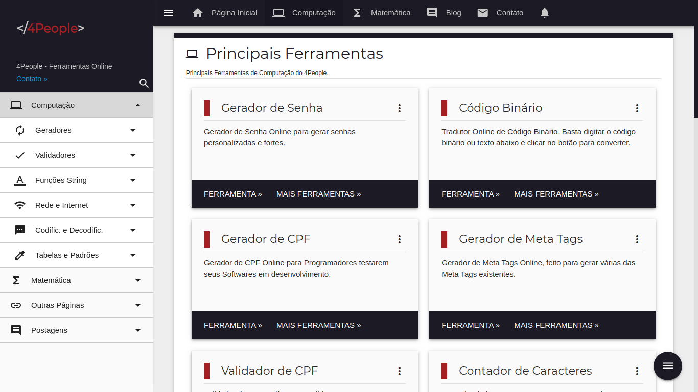
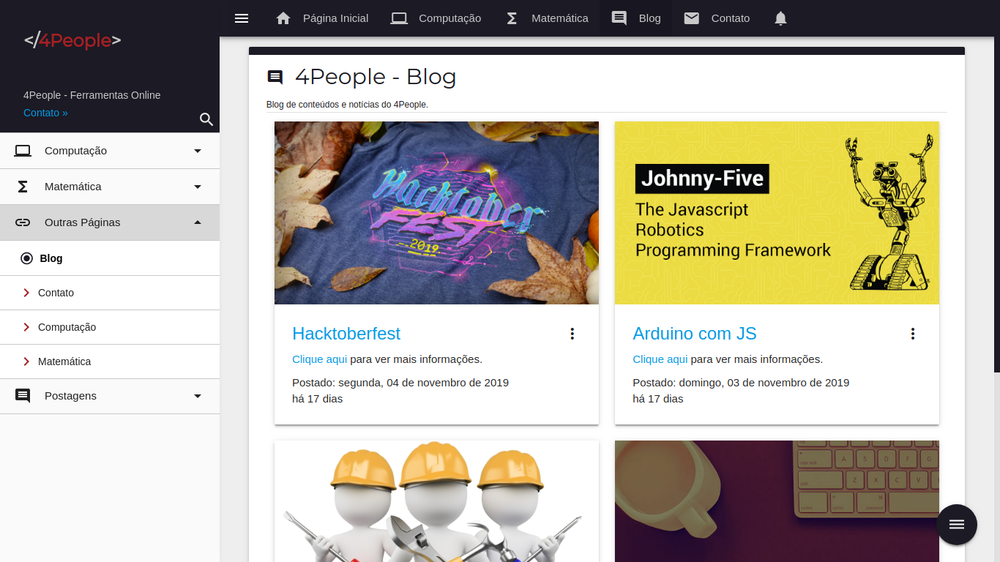

# 4People

## Descrição

O 4People é um Sistema Web que traz vários tipos de ferramentas Computacionais para Desenvolvedores de Softwares e estudantes de informática, assim como ferramentas Matemáticas para alunos e professores. 4People também possui um sistema de Blog integrado. Além disso, ele é de código aberto, ou seja, qualquer um pode visualizar seu código fonte, e usá-lo para estudos e até mesmo melhorá-lo.

## Tecnologias

- HTML5
- CSS3
- JavaScript
- PHP
- MySQL

## Ferramentas

- VSCode
- Docker ou XAMPP
- phpMyAdmin

## Como usar o Projeto

- Clonar este repositório.
  - git clone [https://github.com/lucasgdb/4People.git](https://github.com/lucasgdb/4People.git)
- Importar o banco de dados no MySQL/PHPMyAdmin.
  - Localização do database.sql: /assets/database/database.sql
- Mudar as configurações de seu SQL em /assets/src/php/Connection.php
	- Senha, host, dbname, entre outros.
- Windows
  - Colar a pasta 4People no htdocs do xampp.
  - Ou como preferir.
- Linux
  - Ligar o PHP na pasta do 4People.
    - php -S localhost:3000
    - Ou como preferir.

## Como colaborar

- Faça os mesmos passos de como usar o Projeto acima.
- Faça as mudanças.
- Dê um Commit e abra um PR no [GitHub](https://github.com/lucasgdb/4People) do projeto.

## Autor

| [ @lucasgdb](https://github.com/lucasgdb) |
| :---: |

## Imagens

- Página Inicial

- Página Inicial 2

- Computação

- Matemática

- Blog

- Contato

